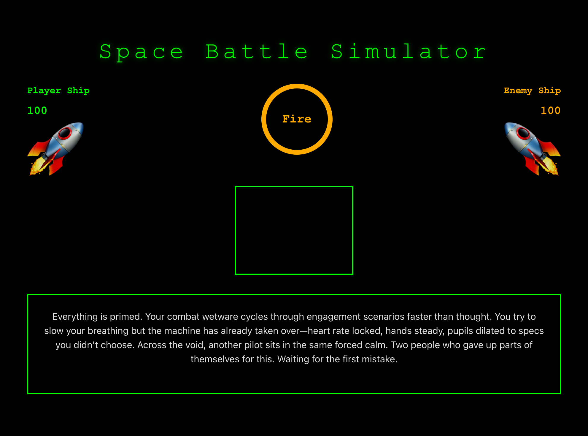

# Space Battle Simulator

A small, retro-styled React + Vite demo that simulates a terse, contemplative dogfight between two piloted vessels.

## Try it on GitHub Pages

This repo is deployed to GitHub Pages, you can try the live demo at:

- https://perkolatte.github.io/space-battle-simulator/



## Local build

1. Install dependencies:
   ```bash
   npm ci
   ```
2. Run development server:
   ```bash
   npm run dev
   ```
3. Open http://localhost:5173 in your browser.

## Build

Build the production bundle:

```bash
npm run build
```

Preview the production build locally:

```bash
npm run preview
# or: npx serve dist
```

## Inspiration

The project draws atmosphere and tone from contemplative, transhumanist RPGs and space-opera narratives.
